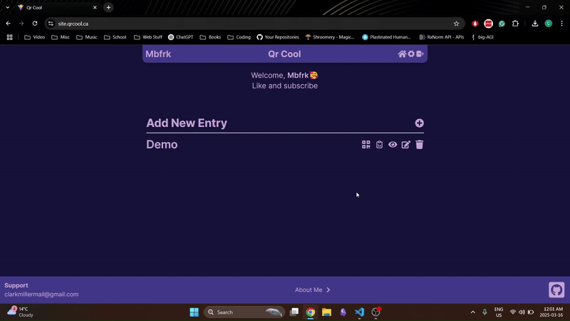

# QrCool

> Dynamic Content on Link Management Application

[](LICENSE)
[]()
[](https://github.com/USERNAME/REPO/actions)

---

# 1. Table of Contents

- [QrCool](#qrcool)
- [1. Table of Contents](#1-table-of-contents)
- [2. Introduction](#2-introduction)
  - [2.1 Overview](#21-overview)
  - [2.2 Features](#22-features)
- [3 Getting Started](#3-getting-started)
  - [3.1 Prerequisites](#31-prerequisites)
  - [3.2 Installation](#32-installation)
    - [3.2.1 Backend](#321-backend)
    - [3.2.2 Frontend](#322-frontend)
- [4. License](#4-license)

---

# 2. Introduction

## 2.1 Overview

QrCool solves the problem of wanting to create a QrCode for some kind of content (text, image, video, html, etc...) but having to go through a complicated mediator. It provides the value of having instant content swapping, a simple and intuitive interface and free content upload.

**Demo**



---

## 2.2 Features

- ✅ Content Swapping - Can change the content of a URL at any time, previous content is saved.
- ✅ QR Code Customization - Can customize the QR code for a URL with any color or icon.

---

# 3 Getting Started

## 3.1 Prerequisites

List everything needed before installation (runtime versions, tools, accounts, etc.).

```
Node.js >= 18
npm >= 9
```

## 3.2 Installation
Step-by-step instructions to get the project running locally.

``` bash
# 1. Clone the repository
git clone https://github.com/DevClarkMiller/qrcool.git
cd qrcool
```

### 3.2.1 Backend
```bash
# 2. Install dependencies
cd backend
npm install

# 3. Run the project
npm run start:dev
```

### 3.2.2 Frontend
```bash
# 2. Install dependencies
cd frontend/QrCool
npm install

# 3. Copy and configure environment variables
cp .env.example .env

# 4. Run the project
npm start:dev
```

---

# 4. License

Distributed under the MIT License. See [LICENSE](LICENSE) for details.

---